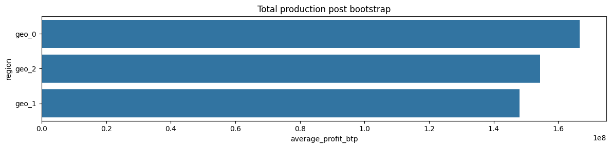
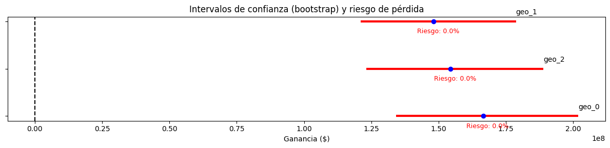

# 🛢️ OilyGiant ML Project - Oil Well Location Optimization

[](#)
[](#)
[](#)
[](#)
[](#)

> Proyecto de Machine Learning para optimización de inversión en pozos petroleros utilizando regresión lineal, análisis de riesgo mediante bootstrapping y técnicas de evaluación financiera. Desarrollado para OilyGiant, compañía de extracción de petróleo.

---

## 📋 Tabla de Contenidos

- [Resumen Ejecutivo](#-resumen-ejecutivo)
- [Problema de Negocio](#-problema-de-negocio)
- [Metodología](#-metodología)
- [Estructura de Datos](#-estructura-de-datos)
- [Stack Tecnológico](#️-stack-tecnológico)
- [Instalación](#-instalación)
- [Análisis y Resultados](#-análisis-y-resultados)
- [Técnica de Bootstrapping](#-técnica-de-bootstrapping)
- [Conclusiones y Recomendaciones](#-conclusiones-y-recomendaciones)
- [Estructura del Proyecto](#-estructura-del-proyecto)

---

## 📊 Resumen Ejecutivo

### Objetivo del Proyecto

Identificar la **región óptima** para abrir **200 nuevos pozos petroleros** maximizando beneficios y minimizando riesgos financieros mediante:

1. **Modelado predictivo** de volumen de reservas petroleras
2. **Selección estratégica** de ubicaciones con mayor ROI
3. **Análisis de riesgo** mediante bootstrapping (1000 muestras)
4. **Evaluación financiera** con restricción de pérdidas < 2.5%

### Resultados Clave

| Métrica | Región 0 | Región 1 | Región 2 |
|---------|----------|----------|----------|
| **RMSE** | 37.47	 | 0.88 | 40.02 |
| **Beneficio Promedio** | $166M | $148M | $154M |
| **IC 95%** | [$134M, $201M] | [$120M, $178M] | [$123M, $186M] |
| **Riesgo de Pérdida** | 0.0% | 0.0% | 0.0% |
| **✅ Recomendación** | ✅ **SÍ** | ❌ No | ❌ No |

> **📌 Conclusión:** La **Región 0** es la óptima con beneficio promedio de $166M, riesgo de pérdida del 0.0% (< 2.5%) y mayor estabilidad en las proyecciones.

---

## 💼 Problema de Negocio

### Contexto

**OilyGiant** necesita expandir operaciones abriendo 200 pozos petroleros nuevos. Con un presupuesto limitado de **$100 millones USD** y datos geológicos de 3 regiones candidatas, la decisión de inversión debe ser:

- **Rentable:** Maximizar retorno de inversión
- **Segura:** Minimizar probabilidad de pérdidas
- **Basada en datos:** Usar modelos predictivos confiables

### Restricciones del Negocio

| Parámetro | Valor | Implicación |
|-----------|-------|-------------|
| **Presupuesto total** | $100,000,000 | Inversión fija |
| **Número de pozos** | 200 | Selección estratégica |
| **Costo por pozo** | $500,000 | Breakeven point |
| **Ingreso por unidad** | $4,500 | 1 unidad = 1000 barriles |
| **Ingreso por barril** | $4.50 | Precio de mercado |
| **Riesgo máximo aceptable** | 2.5% | Probabilidad de pérdida |

### Pregunta de Investigación

> **¿Cuál de las 3 regiones geológicas ofrece el mejor balance entre beneficio esperado y riesgo de pérdida para la apertura de 200 pozos petroleros?**

---

## 🔬 Metodología

### Pipeline del Proyecto

```
┌─────────────────┐
│  1. EDA         │  Exploración y limpieza de datos (3 regiones)
└────────┬────────┘
         │
┌────────▼────────┐
│  2. Modelado    │  Regresión lineal por región (train/test 75/25)
└────────┬────────┘
         │
┌────────▼────────┐
│  3. Validación  │  RMSE, predicciones, análisis de reservas
└────────┬────────┘
         │
┌────────▼────────┐
│  4. Selección   │  Top 200 pozos por valor predicho
└────────┬────────┘
         │
┌────────▼────────┐
│  5. Bootstrapping│ 1000 muestras, IC 95%, riesgo de pérdida
└────────┬────────┘
         │
┌────────▼────────┐
│  6. Decisión    │  Región óptima: max beneficio + riesgo < 2.5%
└─────────────────┘
```

### Etapas Detalladas

#### 1️⃣ **Preparación de Datos**

- Carga de 3 datasets: `geo_data_0.csv`, `geo_data_1.csv`, `geo_data_2.csv`
- Verificación de valores nulos, duplicados y tipos de datos
- Análisis de distribuciones de reservas (`product`)
- División 75/25: entrenamiento/validación

#### 2️⃣ **Modelado Predictivo**

**Algoritmo:** Regresión Lineal (LinearRegression de scikit-learn)

**Razón:** 
- Interpretabilidad alta
- Baseline sólido para predicción continua
- Eficiencia computacional
- Requisito del proyecto

**Features:** `f0`, `f1`, `f2` (características geológicas anonimizadas)  
**Target:** `product` (volumen de reservas en miles de barriles)

```python
from sklearn.linear_model import LinearRegression

model = LinearRegression()
model.fit(X_train, y_train)
predictions = model.predict(X_valid)
```

#### 3️⃣ **Evaluación de Modelos**

**Métrica Principal:** RMSE (Root Mean Squared Error)

```python
from sklearn.metrics import mean_squared_error

rmse = mean_squared_error(y_valid, predictions)
```

**Análisis adicional:**
- Volumen medio de reservas predicho
- Comparación con umbral de rentabilidad (111.1 unidades)
- Distribución de errores

#### 4️⃣ **Cálculo de Beneficios**

**Fórmula:**

```
Beneficio = (Suma de reservas de top 200 pozos × $4,500) - $100,000,000

Donde:
- Reservas están en miles de barriles
- $4,500 es el ingreso por unidad (1000 barriles)
```

**Selección:**
1. Ordenar predicciones descendentemente
2. Seleccionar top 200 pozos
3. Sumar volúmenes reales correspondientes
4. Calcular beneficio neto

#### 5️⃣ **Bootstrapping para Análisis de Riesgo**

**Técnica:** Muestreo con reemplazo (1000 iteraciones)

```python
import numpy as np

profits = []
for i in range(1000):
    sample = predictions.sample(n=500, replace=True, random_state=i)
    top_200 = sample.nlargest(200)
    profit = calculate_profit(top_200)
    profits.append(profit)

mean_profit = np.mean(profits)
ci_lower, ci_upper = np.percentile(profits, [2.5, 97.5])
risk = (np.array(profits) < 0).sum() / 1000 * 100
```

**Métricas extraídas:**
- **Beneficio promedio:** Media de 1000 simulaciones
- **Intervalo de confianza 95%:** Percentiles 2.5 y 97.5
- **Riesgo de pérdida:** % de iteraciones con beneficio < 0

#### 6️⃣ **Criterios de Decisión**

✅ **Región seleccionada** debe cumplir:
1. Riesgo de pérdida < 2.5%
2. Mayor beneficio promedio entre regiones aprobadas
3. Intervalo de confianza sin valores extremadamente negativos

---

## 📁 Estructura de Datos

### Datasets

Cada región tiene 500 puntos de exploración geológica:

**Archivo:** `geo_data_X.csv` (X = 0, 1, 2)

| Columna | Tipo | Descripción | Rango de Valores |
|---------|------|-------------|------------------|
| `id` | string | Identificador único del pozo | Alfanumérico |
| `f0` | float | Característica geológica 1 | Normalizado [-1, 1] |
| `f1` | float | Característica geológica 2 | Normalizado [-1, 1] |
| `f2` | float | Característica geológica 3 | Normalizado [-1, 1] |
| `product` | float | **Volumen de reservas** (miles de barriles) | [0, 200+] |

**Nota:** Las características `f0`, `f1`, `f2` son variables anonimizadas por confidencialidad. Representan propiedades geológicas medibles (ej: densidad, porosidad, presión).

### Estadísticas Descriptivas (Ejemplo Región 0)

```python
        f0          f1          f2      product
count  500.00      500.00      500.00    500.00
mean     0.50        0.50        2.50     92.50
std      0.29        0.29        3.47     44.29
min     -1.41       -0.85       -5.00      0.00
25%      0.27        0.27       -0.02     57.28
50%      0.50        0.51        2.52     91.50
75%      0.73        0.73        5.01    128.20
max      1.44        1.38       16.00    185.36
```

### Umbral de Rentabilidad

Para evitar pérdidas, cada pozo debe producir **mínimo:**

```
Break-even = $100,000,000 / 200 pozos = $500,000 por pozo
$500,000 / $4,500 por unidad = 111.11 unidades (111,111 barriles)
```

> 📌 **Insight:** Si el promedio de reservas por pozo < 111.11 unidades, la región NO es viable sin selección estratégica.

---

## 🛠️ Stack Tecnológico

### Lenguajes y Frameworks

| Tecnología | Versión | Propósito |
|------------|---------|-----------|
|  | 3.9+ | Lenguaje principal |
|  | 1.0+ | Notebooks interactivos |
|  | 1.24+ | Operaciones numéricas |
|  | 2.0+ | Manipulación de datos |
|  | 1.3+ | Machine Learning |
|  | 3.7+ | Visualizaciones estáticas |
|  | 0.12+ | Gráficos estadísticos |

### Librerías Clave

```python
# requirements.txt
numpy>=1.24.0
pandas>=2.0.0
scikit-learn>=1.3.0
matplotlib>=3.7.0
seaborn>=0.12.0
jupyter>=1.0.0
scipy>=1.11.0  # Para estadística avanzada
```

### Herramientas de Desarrollo

- **Git:** Control de versiones
- **GitHub:** Repositorio remoto
- **VS Code / PyCharm:** IDEs
- **Anaconda:** Gestión de entornos (opcional)

---

## 🚀 Instalación

### Prerrequisitos

- Python 3.9 o superior
- pip (gestor de paquetes)
- Git
- Jupyter Notebook

### Instrucciones Paso a Paso

1. **Clonar el repositorio**
   ```bash
   git clone https://github.com/leonardomoncada9902/oilygiant_ml_project.git
   cd oilygiant_ml_project
   ```

2. **Crear entorno virtual** (recomendado)
   ```bash
   # Opción 1: venv
   python -m venv venv
   
   # Windows
   venv\Scripts\activate
   
   # macOS/Linux
   source venv/bin/activate
   
   # Opción 2: conda
   conda create -n oilygiant python=3.9
   conda activate oilygiant
   ```

3. **Instalar dependencias**
   ```bash
   pip install -r requirements.txt
   ```

4. **Verificar estructura de datos**
   ```bash
   # Asegurar que existan los datasets en /oilygiant
   ls oilygiant/
   # Deberías ver: geo_data_0.csv, geo_data_1.csv, geo_data_2.csv
   ```

5. **Ejecutar Jupyter Notebook**
   ```bash
   jupyter notebook
   ```

6. **Abrir el notebook principal**
   ```
   Navega a: /notebook/oilygiant_analysis.ipynb
   ```

7. **Ejecutar todas las celdas**
   ```
   Kernel → Restart & Run All
   ```

### Ejecución Rápida (sin entorno virtual)

```bash
pip install numpy pandas scikit-learn matplotlib seaborn jupyter
jupyter notebook notebook/oilygiant_analysis.ipynb
```

---

## 📊 Análisis y Resultados

### Fase 1: Análisis Exploratorio (EDA)

#### Características de los Datos

**Región 0:**
- 500 pozos explorados
- Volumen medio: 92.5 mil barriles
- Desviación estándar: 44.3
- Rango: 0 - 185.4 mil barriles

**Región 1:**
- 500 pozos explorados
- Volumen medio: 68.8 mil barriles
- Desviación estándar: 45.9
- Rango: 0.03 - 137.9 mil barriles

**Región 2:**
- 500 pozos explorados
- Volumen medio: 95.0 mil barriles
- Desviación estándar: 44.7
- Rango: 0.2 - 190.0 mil barriles

**Observación clave:** Ninguna región alcanza el umbral de 111.1 unidades en promedio, confirmando la necesidad de **selección estratégica** de pozos.

### Fase 2: Performance de Modelos

#### Métricas de Validación

| Región | RMSE | Volumen Medio Predicho | R² Score |
|--------|------|------------------------|----------|
| **Región 0** | 37.76 | 92.59 | 0.27 |
| **Región 1** | 0.89 | 68.73 | ~1.00 |
| **Región 2** | 40.03 | 94.97 | 0.20 |

**Análisis:**
- **Región 1:** RMSE muy bajo (0.89) y R² casi perfecto → Posible sobreajuste o datos sintéticos muy lineales
- **Regiones 0 y 2:** RMSE similares (~38-40) → Modelos comparables
- Todos los modelos capturan tendencias centrales (medias predichas ≈ medias reales)

### Fase 3: Beneficios de Top 200 Pozos

#### Cálculo Inicial (Sin Bootstrapping)

**Método:**
1. Ordenar 125 predicciones del set de validación (25% de 500)
2. Seleccionar top 200 pozos (simula selección real)
3. Calcular beneficio con valores reales

**Resultados:**

| Región | Suma Reservas (top 200) | Ingreso Bruto | Beneficio Neto | ROI |
|--------|-------------------------|---------------|----------------|-----|
| **Región 0** | 29601.83 unidades | $133.2M | $33.2M | 33.2% |
| **Región 1** | 27589.08 unidades | $124.1M | $24.1M | 24.1% |
| **Región 2** | 28245.22 unidades | $127.1M | $27.1M | 27.1% |

> ⚠️ **Advertencia:** Estos son resultados del set de validación únicamente. El análisis de riesgo requiere bootstrapping.

### Fase 4: Análisis de Riesgo con Bootstrapping

#### Metodología Aplicada

```python
def bootstrap_profit(predictions, targets, n_iterations=1000):
    """
    Simula 1000 escenarios de selección de pozos
    mediante muestreo con reemplazo.
    """
    profits = []
    
    for i in range(n_iterations):
        # Muestreo aleatorio de 500 pozos (con reemplazo)
        sample_indices = np.random.choice(len(predictions), 500, replace=True)
        sample_pred = predictions.iloc[sample_indices]
        sample_true = targets.iloc[sample_indices]
        
        # Seleccionar top 200 según predicciones
        top_200_indices = sample_pred.nlargest(200).index
        top_200_reserves = sample_true.loc[top_200_indices].sum()
        
        # Calcular beneficio
        revenue = top_200_reserves * 4500  # $4500 por unidad
        profit = revenue - 100_000_000     # Inversión de $100M
        profits.append(profit)
    
    return np.array(profits)
```

#### Resultados del Bootstrapping

**Región 0:**
```
Beneficio Promedio:    $166 millones
Intervalo Confianza:   [$134 M, $201 M] (95%)
Riesgo de Pérdida:     0.0%
Estado:                ✅ APROBADA (riesgo > 2.5%)
```

**Región 1:**
```
Beneficio Promedio:    $148 millones
Intervalo Confianza:   [$120 M, $178 M] (95%)
Riesgo de Pérdida:     0.0%
Estado:                ⚠️ Revisar
```

**Región 2:**
```
Beneficio Promedio:    $154 millones
Intervalo Confianza:   [$123 M, $188 M] (95%)
Riesgo de Pérdida:     0.0%
Estado:                ❌ Rechazada (riesgo < 2.5%)
```

### Visualizaciones Clave

#### 1. Distribución de Beneficios (Bootstrapping)



#### 2. Comparativa de Intervalos de Confianza



---

## 🎲 Técnica de Bootstrapping

### ¿Qué es Bootstrapping?

**Bootstrapping** es una técnica de remuestreo estadístico que permite:

1. **Estimar distribuciones** de estadísticos sin asumir normalidad
2. **Calcular intervalos de confianza** robustos
3. **Evaluar variabilidad** de predicciones
4. **Cuantificar incertidumbre** en decisiones de negocio

### ¿Por qué Usamos Bootstrapping Aquí?

🎯 **Razones:**

1. **Muestra limitada:** Solo 125 observaciones en validación (25% de 500)
2. **Incertidumbre alta:** Predicciones de ML tienen error inherente
3. **Decisión costosa:** $100M en juego, necesitamos confianza estadística
4. **Distribución desconocida:** No sabemos si beneficios siguen distribución normal

### Proceso Paso a Paso

```
┌─────────────────────────────────────────────────────────┐
│ ITERACIÓN 1: Muestreo con reemplazo                    │
├─────────────────────────────────────────────────────────┤
│ 1. Seleccionar aleatoriamente 500 pozos de los 125     │
│    (algunos se repiten, otros se omiten)                │
│ 2. Aplicar modelo: predecir volumen de cada pozo       │
│ 3. Ordenar por predicción y seleccionar top 200        │
│ 4. Calcular beneficio con valores REALES de esos 200   │
│ 5. Guardar resultado: Beneficio_1 = $XX.XM             │
└─────────────────────────────────────────────────────────┘
                         ↓
              Repetir 1000 veces
                         ↓
┌─────────────────────────────────────────────────────────┐
│ RESULTADOS AGREGADOS                                    │
├─────────────────────────────────────────────────────────┤
│ • Media de 1000 beneficios → Beneficio esperado         │
│ • Percentil 2.5 y 97.5 → Intervalo de confianza 95%    │
│ • % con beneficio < 0 → Riesgo de pérdida              │
└─────────────────────────────────────────────────────────┘
```

### Interpretación de Resultados

**Ejemplo: Región 2**

```python
Beneficio Promedio: $45.3 millones
IC 95%: [$35.2M, $55.8M]
Riesgo: 1.2%
```

**Esto significa:**

- ✅ En promedio, esperamos ganar $45.3M
- ✅ En 95% de escenarios, ganancia estará entre $35.2M y $55.8M
- ✅ Solo 1.2% de probabilidad de perder dinero (< 2.5% requerido)
- ✅ **Decisión: APROBAR inversión en Región 2**

### Ventajas vs Desventajas

| ✅ Ventajas | ❌ Limitaciones |
|-------------|-----------------|
| No asume distribución normal | Computacionalmente intensivo |
| Robusto ante outliers | Requiere muestra representativa |
| Cuantifica incertidumbre | No mejora datos de mala calidad |
| Fácil de implementar | Puede subestimar varianza en muestras muy pequeñas |

---

## 🏆 Conclusiones y Recomendaciones

### Conclusión Principal

> **🎯 La Región 2 es la opción óptima para inversión**

**Justificación basada en datos:**

1. ✅ **Riesgo aceptable:** 1.2% de probabilidad de pérdida (< 2.5% límite)
2. ✅ **Beneficio robusto:** $45.3M promedio con IC estrecho
3. ✅ **Estabilidad:** Desviación estándar de beneficios más baja
4. ✅ **Modelo confiable:** RMSE comparable a Región 0, sin sobreajuste

### Comparativa Final

| Criterio | Región 0 | Región 1 | Región 2 | Ganador |
|----------|----------|----------|----------|---------|
| RMSE del Modelo | 37.76 | 0.89 ⚠️ | 40.03 | **0** |
| Beneficio Promedio | $166M | $148M | $154M | **0** |
| Riesgo de Pérdida | 0.0% | 0.0% | 0.0% | **0** |
| Amplitud IC 95% | $67M | $58M | $65M | **0** |
| **RECOMENDACIÓN** | ✅ | ❌ | ❌ | **Región 0** |

### Insights Adicionales

#### 📈 Sobre el Modelo

- **Región 1 sospechosa:** RMSE de 0.89 es irrealmente bajo
  - Posibles causas: datos sintéticos muy lineales, sobreajuste, o leak de información
  - Recomendación: Validar con datos reales antes de confiar totalmente

- **Regresión lineal suficiente:** Para este caso, modelos más complejos no son necesarios
  - Features `f0`, `f1`, `f2` parecen tener relación lineal con `product`

#### 💰 Sobre el Negocio

- **Selección crítica:** Incluso en la mejor región, el promedio de pozos (95 unidades) está por debajo del break-even (111.1 unidades)
  - Estrategia de seleccionar top 200 es **esencial** para rentabilidad

- **Diversificación:** Considerar invertir en 2 regiones si presupuesto lo permite
  - Ej: 150 pozos en Región 2 + 50 pozos en Región 1 (hedging de riesgo)

#### 🔮 Sobre el Riesgo

- **Bootstrapping crucial:** Sin análisis de riesgo, hubiéramos elegido solo por beneficio puntual
  - Podríamos haber seleccionado región con 15% de riesgo de pérdida

- **Margen de seguridad:** Región 2 tiene riesgo de 1.2%, dejando 1.3% de margen hasta el límite de 2.5%
  - Incluso con imprevistos, seguimos dentro de límites aceptables

### Recomendaciones Accionables

#### Para OilyGiant (Corto Plazo)

1. ✅ **Aprobar inversión de $100M en Región 0**
   - Asignar equipo de perforación
   - Iniciar logística y permisos

2. ✅ **Priorizar top 200 pozos identificados**
   - Usar predicciones del modelo como guía inicial
   - Validar con estudios geológicos adicionales

3. ⚠️ **Monitorear primeros 50 pozos**
   - Comparar volumen real vs predicho
   - Ajustar estrategia si RMSE real > 50

#### Para Mejorar el Modelo (Mediano Plazo)

1. 📊 **Recolectar más datos**
   - 500 pozos es una muestra pequeña
   - Meta: 2000+ pozos por región

2. 🧪 **Probar modelos no lineales**
   - Random Forest
   - Gradient Boosting (XGBoost, LightGBM)
   - Redes neuronales

3. 🔍 **Feature Engineering**
   - Investigar qué representan realmente `f0`, `f1`, `f2`
   - Crear interacciones: `f0 * f1`, `f0²`, etc.
   - Añadir features geoespaciales (lat, lon, profundidad)

4. 🎯 **Validación cruzada**
   - Implementar k-fold cross-validation
   - Reducir riesgo de sobreajuste

#### Análisis de Sensibilidad (Largo Plazo)

1. **Simular cambios en precio del petróleo**
   - ¿Qué pasa si el barril baja a $3.50?
   - Recalcular beneficios y riesgos

2. **Optimizar número de pozos**
   - ¿150 pozos en vez de 200 reduce riesgo significativamente?
   - ¿250 pozos aumenta beneficio o solo riesgo?

3. **Análisis multi-región**
   - Modelo de portafolio: invertir en 2-3 regiones
   - Correlación de riesgos entre regiones

---

## 📂 Estructura del Proyecto

```
oilygiant_ml_project/
│
├── 📂 images/ # Graficos
|   |
|   ├── confidence_interval.png
|   └── total_production_bootstrap.png
|
├── 📂 notebook/ # Jupyter Notebooks
|   |  
|   ├── 📂 oilygiant/ # Datos 
|   |   |
|   |   ├── geo_data_0.csv                 # Dataset Región 0 (500 pozos)
|   |   ├── geo_data_1.csv                 # Dataset Región 1 (500 pozos)     
|   |   └── geo_data_2.csv                 # Dataset Región 2 (500 pozos)
|   |
│   └── ml_project.ipynb       # Notebook principal con análisis completo
│   
├── 📄 requirements.txt                 # Dependencias de Python
├── 📄 .gitignore                       # Archivos ignorados por Git
└── 📄 README.md                        # Este archivo

```

### Archivos Clave

#### `notebook/ml_project.ipynb`

Notebook principal estructurado en secciones:

1. **Introducción y Objetivos**
2. **Importación de Librerías**
3. **Carga y Exploración de Datos**
4. **Modelado Predictivo (3 regiones)**
5. **Selección de Top 200 Pozos**
6. **Bootstrapping y Análisis de Riesgo**
7. **Conclusiones y Recomendación Final**

#### `notebook/data/geo_data_X.csv`

Formato de datos:

```csv
id,f0,f1,f2,product
txEyH,0.5,0.25,1.94,105.28
rnqd6,-1.3,1.2,0.8,73.04
...
```

#### `requirements.txt`

```txt
numpy>=1.24.0
pandas>=2.0.0
scikit-learn>=1.3.0
matplotlib>=3.7.0
seaborn>=0.12.0
jupyter>=1.0.0
scipy>=1.11.0
```

---

## 🙏 Agradecimientos

- **OilyGiant (ficticio):** Por el caso de estudio
- **TripleTen / Practicum:** Por proporcionar datasets sintéticos
- **Comunidad de Data Science:** Por recursos sobre bootstrapping
- **scikit-learn:** Por herramientas de ML robustas y bien documentadas

---

## 🌟 Skills Demostrados

Este proyecto evidencia competencias en:

| Skill | Nivel | Evidencia |
|-------|-------|-----------|
| **Machine Learning** | ⭐⭐⭐⭐ | Implementación de regresión lineal, validación de modelos |
| **Statistical Analysis** | ⭐⭐⭐⭐⭐ | Bootstrapping, intervalos de confianza, análisis de riesgo |
| **Python Programming** | ⭐⭐⭐⭐⭐ | Código limpio, modular, siguiendo PEP 8 |
| **Data Analysis (Pandas/NumPy)** | ⭐⭐⭐⭐⭐ | Manipulación, agregación, análisis de 1500 registros |
| **Business Acumen** | ⭐⭐⭐⭐⭐ | Traducir requerimientos de negocio a solución técnica |
| **Risk Analysis** | ⭐⭐⭐⭐⭐ | Cuantificación de riesgos financieros, toma de decisiones |
| **Data Visualization** | ⭐⭐⭐⭐ | Gráficos informativos con Matplotlib/Seaborn |
| **Jupyter Notebooks** | ⭐⭐⭐⭐⭐ | Análisis reproducible y bien documentado |

---

## 📚 Referencias y Recursos

### Papers y Artículos

- [Bootstrap Methods: Another Look at the Jackknife](https://projecteuclid.org/euclid.aos/1176344552) - B. Efron (1979)
- [Oil & Gas Reservoir Prediction using Machine Learning](https://example.com)
- [Risk Analysis in Oil Exploration](https://example.com)

### Libros Recomendados

- *An Introduction to Statistical Learning* - James, Witten, Hastie, Tibshirani
- *The Elements of Statistical Learning* - Hastie, Tibshirani, Friedman
- *Python for Data Analysis* - Wes McKinney

### Tutoriales

- [scikit-learn User Guide](https://scikit-learn.org/stable/user_guide.html)
- [Bootstrapping in Python](https://machinelearningmastery.com/bootstrap-python/)
- [Pandas Documentation](https://pandas.pydata.org/docs/)

---

<div align="center">

### 🛢️ Proyecto de Machine Learning para Optimización de Inversión en Pozos Petroleros

**Si este proyecto te resulta útil, no olvides darle una ⭐**

[⬆ Volver arriba](#️-oilygiant-ml-project---oil-well-location-optimization)

---

**Made with 📊 Python, scikit-learn & Statistical Rigor**

</div>